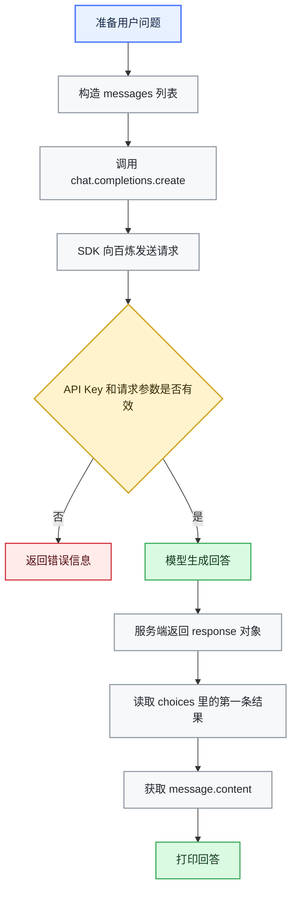

<div align="center">

# 实现一个最基础的单轮问答

</div>

> [!NOTE]
> 本章将从一个最基础的单轮问答示例开始，帮助你了解模型 API 的工作方式：如何创建客户端、发送问题，以及从响应中提取模型生成的答案。

---

**章节导航**

[准备工作](#1-准备工作) · [创建客户端](#2-创建客户端) · [发送问题](#3-发送问题并获取回答) · [完整代码](#4-完整代码) · [工作流程](#5-工作流程) · [响应对象](#6-理解响应对象) · [小结](#7-小结) · [参考资料](#参考资料)

---

## 1. 准备工作

开始前，请先完成以下准备：

1. 安装 Python 3.8 或更高版本。
2. 安装或升级 OpenAI Python SDK：

   ```bash
   pip install -U openai
   ```

3. 获取阿里云百炼 API Key。

> 在本章节中，API Key将会暂时写在主代码中，但这只是为了更直观理解代码，请避免API Key上传或发布在公开平台。

---

## 2. 创建客户端

> 在此教程中，我们将会使用OpenAI提供的SDK，这也是目前使用最为广泛的SDK之一。

在安装并导入了OpenAI SDK后，我们可以尝试创建一个名为client的对象，并传入所需要的参数：

```python
from openai import OpenAI

client = OpenAI(
    api_key="真实使用的API Key",
    base_url="https://dashscope.aliyuncs.com/compatible-mode/v1",
)
```

这里使用了两个关键参数：

| 参数 | 作用 |
| --- | --- |
| `api_key` | API 密钥，用于告诉模型服务提供商”我是谁“, 服务商会把请求产生的费用记到对应账户上。 |
| `base_url` | API 服务地址。根据实际使用的模型服务提供商填入，此处使用的是阿里云百炼平台提供的服务。 |

<details>
<summary><strong>client的初始化其实还有其他可选的参数可以填入，但现阶段只需要了解，并不需要使用：</strong></summary>

| 参数 | 作用 |
| --- | --- |
| `admin_api_key` | OpenAI 组织管理员使用的 API Key |
| `workload_identity` | 企业环境下使用 Workload Identity 进行身份认证 |
| `organization` | 指定请求所属的 OpenAI Organization |
| `project` | 指定请求所属的 OpenAI Project |
| `webhook_secret` | 用于验证 Webhook 请求签名 |
| `provider` | 配置 SDK 使用的服务提供方 |
| `data_residency` | 指定数据驻留区域 |
| `websocket_base_url` | 指定 WebSocket / Realtime API 的服务器地址 |
| `timeout` | 设置一次 HTTP 请求允许等待的最长时间 |
| `max_retries` | 设置请求失败后的最大自动重试次数 |
| `default_headers` | 为所有 API 请求添加默认 HTTP Header |
| `default_query` | 为所有 API 请求添加默认 URL Query 参数 |
| `http_client` | 自定义底层 HTTP 客户端 |
| `_strict_response_validation` | 是否严格校验 API 返回的数据结构，属于 SDK 内部/高级参数 |
| `_enforce_credentials` | 是否强制要求客户端初始化时提供认证信息，属于 SDK 内部参数 |

</details>

---

## 3. 发送问题并获取回答

完成客户端初始化后，接下来就可以尝试向模型发送请求，并获取模型的答复：

```python
messages = [
    {"role": "user", "content": "你好"},
]

response = client.chat.completions.create(
    model="qwen3.8-flash",
    messages=messages,
)

answer = response.choices[0].message.content
print(answer)
```

**这段代码分了三段，分别完成了三件事：**

| 步骤 | 说明 |
| :---: | --- |
| **01** | 构建了名为`messages`的数据列表，并且存入了一个字典，结构也非常简单，就是说话的角色以及对应说的内容。 |
| **02** | 构建了信息列表之后，我们就可以把这个列表发送给模型了，具体操作是使用 `client.chat.completions.create()`这个方法，将模型名称与消息列表作为参数发送给服务端。 |
| **03** | 从响应对象中提取模型的回答，并将它打印到终端。 |

---

## 4. 完整代码

将前面的步骤合并后，可以得到一段可直接运行的代码：

```python
from openai import OpenAI

client = OpenAI(
    api_key="真实使用的API Key",
    base_url="https://dashscope.aliyuncs.com/compatible-mode/v1",
)

messages = [
    {"role": "user", "content": "你好"},
]

response = client.chat.completions.create(
    model="qwen3.8-flash",
    messages=messages,
)

answer = response.choices[0].message.content
print(answer)
```

> 运行后，终端会输出模型生成的回答。你也可以把数据列表中的问题修改成你想要的内容，并观察模型的答复。
> 由于模型输出具有一定随机性，你每次看到的内容可能略有不同。

---

## 5. 工作流程

下面的流程图展示了从准备问题到输出答案的完整过程：



---

## 6. 常见问答
### 
### 问：为什么不直接打印 `response`？

实际上，`response` **可以直接打印**，但打印出来的是完整的响应对象，这个对象包括了非常多的内容，而不只是模型回答。它通常还包含：

- 请求 ID；
- 实际使用的模型；
- 模型生成的一个或多个候选结果；
- 停止生成的原因；
- Token 使用量等统计信息。

响应结构可以简化理解为：

```text
response
└── choices
    └── [0]
        └── message
            └── content
```

其中：

- `response.choices` 是候选回答列表；
- `response.choices[0]` 表示第一条候选回答；
- `.message` 表示模型返回的消息；
- `.content` 才是最终需要展示的文本内容。

因此，下面这行代码用于准确获取第一条回答的正文：

```python
answer = response.choices[0].message.content
```

如果想观察完整的响应结构，可以使用：

```python
print(response.model_dump_json(indent=2))
```

---

## 7. 小结

到这里，我们已经完成了一次最基础的模型调用：

1. 配置 API Key 和服务地址；
2. 创建 OpenAI 客户端；
3. 使用 `messages` 描述用户问题；
4. 调用模型并接收响应；
5. 从 `response.choices[0].message.content` 中提取回答。

> 目前的程序只能完成一次独立问答，在模型完成回答后应用就会结束，且不会储存过往的问答结果。这一章节的目的主要是体验API的调用，并且获取模型的答复。
> 下一章节我们将会把这一结构升级为带记忆的问答。

---

## 参考资料

- [阿里云百炼：安装 SDK](https://help.aliyun.com/zh/model-studio/install-sdk)
- [阿里云百炼：获取与配置 API Key](https://help.aliyun.com/zh/model-studio/get-api-key/)
- [阿里云百炼：通过 OpenAI 接口调用千问模型](https://help.aliyun.com/zh/model-studio/compatibility-of-openai-with-dashscope)
- [OpenAI Chat Completions API Reference](https://developers.openai.com/api/reference/resources/chat)
