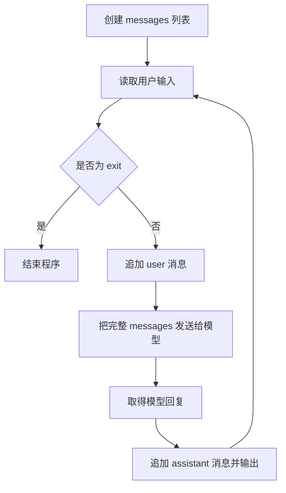

<div align="center">

# 带有记忆的问答

</div>

> [!NOTE]
> 上一章中，我们通过 API 完成了最基础的单轮问答。本章将在此基础上实现一个可以连续交流的命令行聊天程序，并理解多轮对话中“记忆”的工作原理。
> 与我们常用的网页端或者是客户端的大模型体验不同，通过调用API与模型互动的每一次请求都是独立的，模型并不会知道用户的上一个问题是什么。
而常用的大模型应用之所以可以让聊天带有记忆，是因为我们在每一轮送出问题的同时，其实背后需要把此前聊过的所有内容都同时一起传输给模型，让模型能知道过去都聊过什么，从而能够结合过去的聊天记录给出本轮的回答。上一章节所使用到的messages数据列表，就是用于储存聊天记录的。

---

**章节导航**

[把应用优化为由用户在前端输入问题和多轮对话](#1-把应用优化为由用户在前端输入问题和多轮对话) · [通过管理消息列表实现上下文](#2-通过管理消息列表实现上下文) · [常见问答](#4-常见问答) · [小结](#7-小结) · [参考资料](#参考资料)

---

## 1. 把应用优化为由用户在前端输入问题和多轮对话

在上一章节，我们已经成功把代码构建为以下样式:

```python
from openai import OpenAI

client = OpenAI(
    api_key="真实使用的API Key",
    base_url="https://dashscope.aliyuncs.com/compatible-mode/v1",
)

messages = [
    {"role": "user", "content": "你好"},
]

response = client.chat.completions.create(
    model="qwen3.8-flash",
    messages=messages,
)

answer = response.choices[0].message.content
print(answer)
```

但是这段代码目前只支持单次的问答，而且每次更改提问的问题都需要直接修改代码中数据列表，非常麻烦。
所以我们可以稍加调整，把提问修改成从终端输入，并且加入一个根据exit指令停止的循环，使得用户体验能变得更好。

```python
from openai import OpenAI

client = OpenAI(
    api_key="真实使用的API Key",
    base_url="https://dashscope.aliyuncs.com/compatible-mode/v1",
)

def agent_loop():
    
    while True:

        user_input = input("user:")
        if user_input == "exit":
            break

        message = [
                    {"role": "user", "content": user_input }
                    ]
        response = client.chat.completions.create(
            model = "qwen3.8-flash",
            messages = message
        )
        assistant_messages = response.choices[0].message.content
        print(assistant_messages)

agent_loop()
```

这样我们就完成了一个可以运行后一直对话的程序，直到用户输入exit指令退出。
至少现在我们不需要每次想要输入问题的时候，都要启动一次应用。
但是这段程序仍然没有记忆，也就是我们常说的上下文，这时候我们需要再进一步。

---

## 2. 通过管理消息列表实现上下文

### 2.1 把输入/输出写入消息列表

> 在上一章节，我们构建了名为messages的消息列表，但是里面始终只有一条消息，也就是用户当前的输入。
> 想要实现上下文，我们可以通过更好的管理消息列表，从而让模型看到之前聊过什么。

仔细观察我们已经构建好的代码，可以看到有两个关键节点，第一个是用户输入，第二个是模型的回答返回。我们可以在这两个节点加入一个写入的功能，把当前位置的输入/输出记录在消息列表中。
我们可以把消息列表移出主循坏单独管理，并且初始化为空，所有的消息都在关键节点处写入。

```python
def agent_loop():
    message = []
    while True:
        user_input = input("user:")
        if user_input == "exit":
            break
        #用户完成了写入，可以同步写入到消息列表中
        message.append(
            {"role": "user", "content": user_input}
        )

        response = client.chat.completions.create(
            model = "qwen3.8-flash",
            messages = message
        )
        assistant_messages = response.choices[0].message.content
        #此时已经获取了模型的返回，写入到消息列表中
        message.append(
            {"role": "assistant", "content": assistant_messages}
        )
        print(assistant_messages)

agent_loop()
```

这里只做了三处修改：
1. 把消息列表移出主循坏
2. 在用户写入提问后同步更新到消息列表，随后把消息列表输入到模型
3. 在模型返回结果之后，也在消息列表中记录下来，这样在下一轮对话时，模型就可以看到上一轮的聊天记录，从而实现记忆功能

### 2.2 `messages` 中的三种常见角色

在前面我们已经使用过user和assistant两种角色，这里我们介绍第三种角色`system`
在初始化消息列表的时候，可以加入一条system信息作为背景设定，这也是平时大家比较常听到的`system prompt`
`system` 消息不是必需的，但它有助于让模型的回答风格和行为更加稳定。

| `role` | 含义 | 示例 |
| --- | --- | --- |
| `system` | 设定助手的身份、任务或回答规则 | 你是一个天气查询助手 |
| `user` | 用户提出的问题或要求 | 今天的天气怎么样？ |
| `assistant` | 模型之前给出的回复 | 今天的天气很好 |


---
## 3. 工作流程

下面的流程图展示了一轮对话从接收输入到保存回复的完整过程：



其中最关键的顺序是：

```text
记录当前问题 → 发送完整历史 → 取得回复 → 记录回复 → 进入下一轮
```

如果把 `messages = []` 放进循环，程序每一轮都会丢失历史；如果忘记追加 `assistant` 消息，下一轮看到的对话也会残缺。

---

## 4. 完整可运行代码

```python
from openai import OpenAI

client = OpenAI(
    api_key="真实使用的API Key",
    base_url="https://dashscope.aliyuncs.com/compatible-mode/v1",
)


def agent_loop():
    message = []
    while True:
        user_input = input("user:")
        if user_input == "exit":
            break
        #用户完成了写入，可以同步写入到消息列表中
        message.append(
            {"role": "user", "content": user_input}
        )

        response = client.chat.completions.create(
            model = "qwen3.8-flash",
            messages = message
        )
        assistant_messages = response.choices[0].message.content
        #此时已经获取了模型的返回，写入到消息列表中
        message.append(
            {"role": "assistant", "content": assistant_messages}
        )
        print(assistant_messages)
agent_loop()
```

---

## 5. 常见问答
### 
### 问：为什么消息列表要移到主循坏外面？

如果消息列表放在主循环里面，那么在每一次循环开始，消息列表都会重新创建并初始化为空。
假如在第一次对话：
```python
messages = [
    {"role": "user", "content": "你好，我叫张三"}
]
```
而模型的回复是
```python
messages = [
    {"role": "assistant", "content": "张三你好。"}
]
```
此时本轮循环结束了，进入下一次循环的时候执行了
```python
    message = []
```

消息列表就会再次变成空白状态，也就意味着之前的对话就被清空了，这时候你再问”我叫什么名字“时，模型收到的消息列表就只有
```python
messages = [
    {"role": "user", "content": "我叫什么名字"}
]
```
所以模型自然也就不会记得你叫张三

### 问：消息列表越来越长，岂不是越来越臃肿？前面聊的内容会影响新的问题吗？
### 

是的，由于每轮都要重新发送历史消息，`messages` 会越来越长。这会带来三个直接影响：

- 输入 Token 数量增加，调用成本和响应时间可能上升。
- 模型的上下文窗口并不是无限的，历史过长时可能超过限制。
- 很久以前的信息未必仍然重要，过多内容还可能干扰当前回答。

因此在一些成熟的agent工具中，记忆管理是一个非常重要的设计点。在后续的章节中会介绍一些常见的方法。

### 问：程序退出后，模型还记得之前的内容吗？

不记得。本章节介绍的列表保存在当前 Python 进程中，程序退出后就会消失。若要跨启动保留，需要将历史写入文件或数据库，并在下次启动时重新加载。

---

## 5. 小结

本章完成了一个可以在终端中持续运行的多轮对话程序。核心是对消息列表的正确管理：

1. 在循环外初始化 `messages`。
2. 收到输入后，追加 `user` 消息。
3. 将包含历史记录的完整 `messages` 发送给模型。
4. 收到回复后，追加 `assistant` 消息。
5. 在下一轮中继续复用同一个列表。

但需要留意的是，本章实现的只是程序运行期间的上下文记忆，程序退出时记忆会伴随内存释放消失，
在真正用于生产环境时，还需要进一步考虑历史持久化、上下文裁剪、多用户隔离、异常处理、隐私保护和成本控制，在之后的章节中会介绍这部分的内容。

---

## 参考资料

本章节不适用
